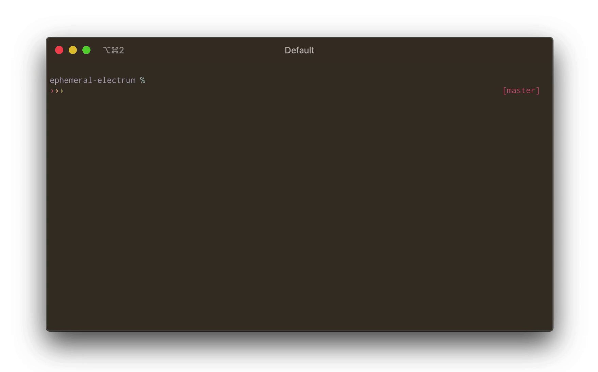

# ephemeral-electrum

[](https://github.com/lukechilds/ephemeral-electrum/actions)
[](https://hub.docker.com/r/lukechilds/ephemeral-electrum/)
[](https://hub.docker.com/r/lukechilds/ephemeral-electrum/tags)
[](https://github.com/sponsors/lukechilds)
[](https://blockstream.info/address/3Luke2qRn5iLj4NiFrvLBu2jaEj7JeMR6w)
[](https://tippin.me/@lukechilds?refurl=github.com/lukechilds/ephemeral-electrum)

> A quick throwaway text based Electrum instance.

Handy for quickly checking the state of a given hierarchical deterministic wallet or single address.

HD wallets can be imported as Electrum or BIP39 mnemonic seed phrases as well as extend public and private keys.

Single addresses can be imported using the Electrum addres-type:wif format.

It's like a muggle friendly [Magical Bitcoin Wallet](https://github.com/MagicalBitcoin/magical-bitcoin-wallet).

<div align="center">
	
</div>

## Usage

```shell
$ seed="much bottom such hurt hunt welcome cushion erosion pulse admit name deer"
$ docker run -it lukechilds/ephemeral-electrum "$seed"
```

You can also specify a single Electrum server to connect to:

```shell
$ docker run -it lukechilds/ephemeral-electrum "$seed" bitcoin.lukechilds.co:50002:s
```

You can pass in a seed phrase, xpub or xprv. The following all open the same wallet:

```shell
$ seed="much bottom such hurt hunt welcome cushion erosion pulse admit name deer"
$ docker run -it lukechilds/ephemeral-electrum "$seed"

$ xprv="zprvAcMRAFo3MYezabw3DuoGtZW4gFsgejCzVBT6mM7dd5TrhN5QSfrEjYcn4ZurjAoBT2ocLY7bH1bLpYKdrg1EbF3FtZjBCC6WPGVWqi7yJyc"
$ docker run -it lukechilds/ephemeral-electrum "$xprv"

$ xpub="zpub6qLmZmKwBvDHo61WKwLHFhSoEHiB4BvqrQNhZjXFBQzqaAQYzDAVHLwFusoTFSwai8ZpR3uKEaYMo34nWiJhJ1v4sbusJRHMSLd3hMZUmcp"
$ docker run -it lukechilds/ephemeral-electrum "$xpub"
```

You can import a single address by passing in the address type and WIF:

```shell
# 1NrjsCoAgkGmZWniw9dunW9ZPJHiywZWA4
$ docker run -it lukechilds/ephemeral-electrum "p2pkh:L3fnoTepxVUcdayujGXFnE4twWcd13zKbPgtyPKhkgmUUSTaPPbR"

# 3N5Z9cXYJxUKD6ydinLw9MdMDtbwLuRDRP
$ docker run -it lukechilds/ephemeral-electrum "p2wpkh-p2sh:L3bm714EVAtRivbdxJ9GBFqCGPsViFzZN1ChH3DUtaZ8AqK1QhQ6"

# bc1qpz4fqgev077446rjzaj7e7pa0jh6j272sjw38g
$ docker run -it lukechilds/ephemeral-electrum "p2wpkh:L2FXuzGMVAPH9CVGfAxNJiT1teR8YGh2BLoummxXY1W51QQVDZ5M"
```

## Build

Build this image yourself by checking out this repo, `cd` ing into it and running:

```shell
$ docker build -t lukechilds/ephemeral-electrum .
```

## License

MIT © Luke Childs
